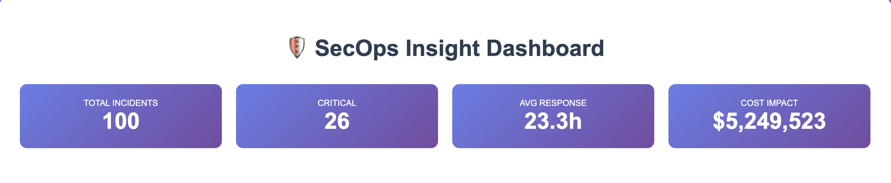
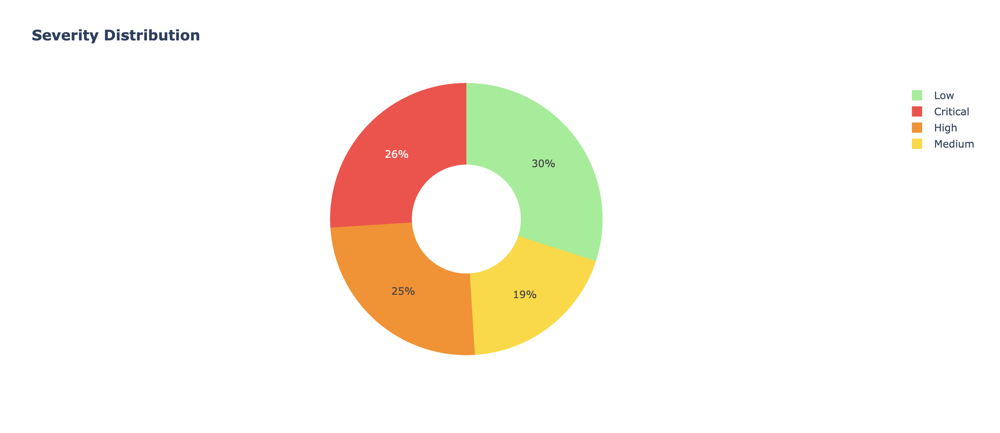
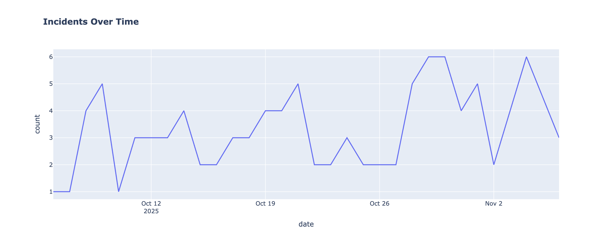

# 🛡️ SecOps Insight Pipeline

**A Project Management Case Study in Data Engineering for Cybersecurity**

---

## 🎯 What This Is

A complete ETL pipeline that analyzes security incidents and generates interactive dashboards. Built to demonstrate the intersection of:
- Technical skills (Python, SQL, data visualization)
- Project Management (planning, documentation, methodology)
- Business Intelligence (KPIs, dashboards, storytelling)
- Cybersecurity domain knowledge

## 📊 The Dashboard

Analyzes 100 security incidents showing:
- Total incidents and severity breakdown
- Cost impact ($5M+)
- Response time metrics
- Trends over 30 days
- Interactive visualizations

  ## 📸 Dashboard Preview

### Full Dashboard View


The dashboard shows real-time metrics and interactive visualizations for 100 security incidents.

### Severity Distribution Chart


Color-coded donut chart showing breakdown of Critical (Red), High (Orange), Medium (Yellow), and Low (Green) severity incidents.

### Incident Timeline


30-day trend analysis showing incident volume over time.

---

💡 **Note:** The full interactive dashboard runs locally. During interviews, I can screen share the live version with hover interactions, zoom capabilities, and real-time filtering.
```

## 🚀 Quick Start
```bash
# Install dependencies
pip3 install pandas plotly

# Run the pipeline
python3 extract_incidents.py
python3 transform_load.py
python3 make_dashboard.py

# Open dashboard
open outputs/dashboard.html
```

## 💼 Skills Demonstrated

**Technical:**
- Python programming
- SQL database design (SQLite)
- ETL pipeline development
- Data visualization (Plotly)
- pandas data analysis

**Project Management:**
- Project planning & scope definition
- Risk management
- Stakeholder communication
- Technical-to-business translation
- Agile methodology

**Business Intelligence:**
- Dashboard design
- KPI identification
- Data storytelling
- Executive reporting

## 📚 Key Documents

- **TRANSLATION_GUIDE.md** - How PM bridges technical and business teams (READ THIS!)
- **PROJECT_CHARTER.md** - Project scope, ROI, stakeholders
- **outputs/dashboard.html** - The interactive dashboard

## 🎓 What I Learned

This project taught me:
- ETL pipeline architecture
- Database design and SQL queries
- Creating professional visualizations
- PM documentation best practices
- How to communicate technical work to non-technical audiences

## 💡 Why This Matters

Most candidates say "I have PM experience." This project proves it with:
- Working code
- Professional documentation
- Clear business value
- Execution proof

## 🔮 Future Enhancements

- Real-time data streaming
- Machine learning for incident prediction
- Additional chart types
- Integration with production SIEM

---

**Built as a portfolio demonstration of PM + Technical capabilities**

SudoChef | sudochef.me 
